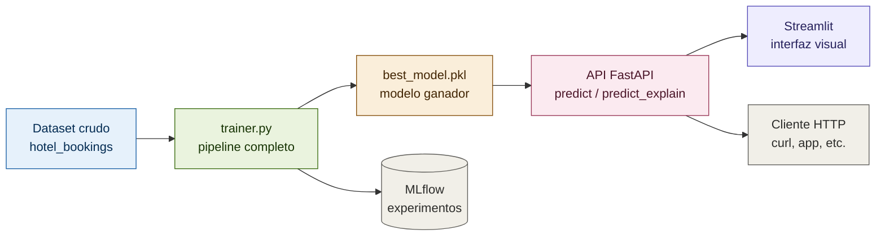

# Práctica Final · Machine Learning y Deep Learning

> Sistema automático de clasificación binaria sobre cancelaciones de reservas hoteleras.
> Máster en IA, Cloud Computing y DevOps · PontIA.tech · 2026

[](https://github.com/jumarfradev/practica-final-ml/actions/workflows/ci.yml)

---

## Autores

- **Juan Martínez Fraile** — LinkedIn: <https://www.linkedin.com/in/juan-martinez-fraile/>
- **David Baos** — GitHub: <https://github.com/davidbaosr>

> Roles y reparto de trabajo detallados en la sección [Roles del equipo](#roles-del-equipo).

---

## Descripción del problema

Este proyecto resuelve un problema de **clasificación binaria** en el sector hotelero:
predecir si una reserva será cancelada (`is_canceled = 1`) o se completará (`is_canceled = 0`)
a partir de información del cliente, características de la reserva y comportamiento histórico.

### El dataset

- **Fuente:** dataset `hotel_bookings` proporcionado por el módulo.
- **Volumen:** 119.390 reservas, 32 variables originales.
- **Variable objetivo:** `is_canceled` (binaria, ~37% cancelaciones / ~63% no cancelaciones).
- **Tipos de variable:** numéricas continuas y enteras, y categóricas (hotel, mes, país, canal, tipo de cliente, etc.).

### Por qué este problema importa

Las cancelaciones son uno de los principales problemas operativos de la industria hotelera:
afectan a la planificación de personal, al precio dinámico y al overbooking. Un modelo que
anticipe la probabilidad de cancelación permite ajustar precios, ofrecer incentivos de
retención o reasignar habitaciones a tiempo.

> Detalle completo del problema, EDA, diseño y reflexión crítica en `docs/informe_final.docx`.

---

## Arquitectura del sistema



El flujo va de los datos crudos al modelo servido: `trainer.py` orquesta el entrenamiento
de los 8 modelos, registra los experimentos en MLflow y persiste el ganador en
`best_model.pkl`. La API FastAPI carga ese modelo y lo expone vía HTTP, de modo que tanto
la interfaz Streamlit como cualquier otro cliente pueden pedir predicciones sin conocer el
modelo por dentro (arquitectura desacoplada frontend/backend).

---

## Resultados y conclusiones

### Métrica principal

Se eligió **ROC-AUC** como métrica principal (y **F1** como secundaria). El dataset está
moderadamente desbalanceado (63/37), por lo que la *accuracy* sería engañosa (un modelo
trivial que prediga siempre "no cancela" ya acertaría el 63%). ROC-AUC mide la capacidad de
ordenar reservas por riesgo de forma independiente del umbral y es robusta al desbalanceo.

### Comparativa de modelos

| Modelo | ROC-AUC | F1 |
|---|---|---|
| **RandomForest OPT** (ganador) | **0.9581** | **0.8384** |
| XGBoost OPT | 0.9577 | 0.8423 |
| XGBoost | 0.9519 | 0.8332 |
| RedNeuronal OPT | 0.9512 | 0.8312 |
| RedNeuronal | 0.9492 | 0.8282 |
| RandomForest | 0.9485 | 0.8088 |
| DecisionTree | 0.9285 | 0.7854 |
| LogisticRegression | 0.9102 | 0.7570 |

### Modelo final

El modelo ganador es un **RandomForest optimizado** (ROC-AUC 0.9581), con hiperparámetros
`n_estimators=300, max_depth=25, min_samples_split=5, min_samples_leaf=1, max_features=sqrt`,
hallados mediante `RandomizedSearchCV`. XGBoost optimizado queda a solo cuatro diezmilésimas
y supera en F1; la elección se sostiene en la métrica principal fijada a priori.

---

## Estructura del proyecto

```
practica-final-ml/
├── .gitignore
├── README.md                      # Este archivo
├── CONTRIBUTING.md                # Flujo de ramas y convenciones
├── requirements.txt               # Dependencias del proyecto
├── pyproject.toml                 # Configuración de black, ruff, etc.
├── trainer.py                     # Script principal: orquesta todo el pipeline
│
├── .github/                       # Workflows de CI (GitHub Actions)
├── data/
│   └── raw/                       # Dataset original (no versionado)
│
├── docs/
│   └── informe_final.docx         # Informe completo de la práctica
│
├── models/                        # Modelos persistidos (no versionados)
│   └── best_model.pkl             # Bundle del mejor modelo (lo genera trainer.py)
│
├── notebooks/
│   └── exploracion/               # Notebooks de EDA, preprocesamiento, modelado y evaluación
│       ├── 01_eda_inicial.ipynb
│       ├── 02_preprocesamiento.ipynb
│       ├── 03_modelado.ipynb
│       └── 04_evaluacion.ipynb
│
├── resultados/
│   ├── metricas/                  # Métricas de cada modelo en JSON
│   └── figuras/                   # Gráficas generadas (PNG)
│
└── src/                           # Código fuente del pipeline
    ├── __init__.py
    ├── data_loader.py             # Carga, limpieza y preprocesamiento (ColumnTransformer)
    ├── models.py                  # Entrenamiento de los 5 modelos base + MLflow
    ├── optimization.py            # Optimización de hiperparámetros (RandomizedSearchCV)
    ├── evaluation.py              # Gráficas de evaluación
    ├── metrics_io.py              # Persistencia de métricas en JSON
    ├── predictor.py               # Inferencia sobre datos crudos
    ├── api.py                     # API REST con FastAPI (bonus)
    ├── interpretabilidad.py       # Explicabilidad con SHAP (bonus)
    ├── analisis_umbral.py         # Umbral óptimo por coste de negocio (bonus)
    └── experimento_balanceo.py    # Comparativa de técnicas de balanceo (bonus)
```

---

## Requisitos e instalación

### Requisitos previos

- **Python 3.11** (gestionado por `uv`)
- **[`uv`](https://docs.astral.sh/uv/)** — gestor de entornos y dependencias
- **git**

### Instalación paso a paso

```bash
# 1. Clonar el repositorio
git clone https://github.com/jumarfradev/practica-final-ml.git
cd practica-final-ml

# 2. Crear el entorno virtual con uv (Python 3.11)
uv venv --python 3.11 env-pontia-ml

# 3. Activar el entorno
# Windows (Git Bash):
source env-pontia-ml/Scripts/activate
# Mac / Linux:
source env-pontia-ml/bin/activate

# 4. Instalar dependencias
uv pip install -r requirements.txt
```

### Verificar la instalación

```bash
python --version       # Debe mostrar: Python 3.11.x
python -c "import pandas, sklearn, tensorflow, xgboost, mlflow; print('OK')"
```

### Colocar el dataset

El dataset no se versiona. Coloca el CSV original en:

```
data/raw/dataset_practica_final.csv
```

---

## Cómo ejecutar el proyecto

### 1. Entrenar y seleccionar el mejor modelo

```bash
# Flujo completo: 8 modelos (5 base + 3 optimizados) — tarda ~15-30 min
python trainer.py

# Modo rápido: solo 5 modelos base — tarda ~2-3 min
python trainer.py --rapido

# Sin registro en MLflow
python trainer.py --sin-mlflow
```

Esto entrena, compara, selecciona el mejor por ROC-AUC y guarda el bundle en
`models/best_model.pkl`.

### 2. Predecir sobre nuevas reservas (CLI)

```bash
python -m src.predictor --input ruta/al/csv_nuevo.csv --output predicciones.csv
```

### 3. API REST (bonus)

```bash
uvicorn src.api:app
```

Documentación interactiva en <http://127.0.0.1:8000/docs>. Endpoints:

- `GET /health` — estado del servicio.
- `GET /model_info` — metadatos del modelo en producción.
- `POST /predict` — predicción de una reserva.
- `POST /predict_batch` — predicción de varias reservas.
- `POST /predict_explain` — predicción + explicación SHAP de las variables más influyentes.

### 4. Interfaz visual con Streamlit (bonus)

```bash
# En una terminal, arranca la API:
uvicorn src.api:app
# En otra terminal, arranca la interfaz (consume la API):
streamlit run streamlit_app.py
```

### 5. Análisis adicionales (bonus)

```bash
# Umbral óptimo según coste de negocio
python -m src.analisis_umbral

# Experimento de balanceo de clases (class_weight vs SMOTE)
python -m src.experimento_balanceo

# Interpretabilidad global con SHAP
python -m src.interpretabilidad

# Interfaz de MLflow para ver los experimentos
mlflow ui
```

### 6. Notebooks

Los notebooks de `notebooks/exploracion/` documentan el proceso: EDA inicial,
preprocesamiento, modelado y evaluación.

---

## Decisiones técnicas destacadas

- **Eliminación de data leakage:** se descartaron `reservation_status`,
  `reservation_status_date` y `assigned_room_type`, variables que solo se conocen tras el
  desenlace de la reserva.
- **Preprocesamiento con `ColumnTransformer`:** imputación, transformación logarítmica de
  variables asimétricas (`lead_time`, `adr`), one-hot encoding y reducción top-N de
  categóricas de alta cardinalidad (`country`, `agent`).
- **Split estratificado** (`random_state=42`) para preservar la proporción 63/37.
- **Decisión razonada de no balancear:** un experimento (`src/experimento_balanceo.py`)
  demuestra que, con desbalanceo moderado, balancear no mejora el ROC-AUC.
- **Umbral por coste de negocio:** el umbral óptimo se elige minimizando el coste, no
  fijándolo en 0.5.

---

## Roles del equipo

La práctica se ha desarrollado **en pareja**, combinando trabajo conceptual conjunto
y ejecución técnica. A lo largo del proyecto se mantuvieron **reuniones de planteamiento
teórico** en las que se discutió cómo abordar la práctica: el diseño de la arquitectura,
el enfoque de desarrollo y las decisiones de ejecución.

El reparto de responsabilidades fue el siguiente:

| Integrante | Rol | Contribución |
|---|---|---|
| **Juan Martínez Fraile** | Ejecución práctica e implementación | Desarrollo y ejecución práctica completa del proyecto: implementación del pipeline, los modelos, la evaluación, la API, la interfaz y la documentación. Responsable de la materialización del código en el repositorio. |
| **David Baos** | Aportación teórica y conceptual | Contribución en el planteamiento teórico de la arquitectura y el desarrollo de la práctica: aportación de ideas de desarrollo y de ejecución, y propuestas para optimizar el enfoque práctico, trabajadas en las reuniones conjuntas. |

> **Nota sobre la evaluación:** el historial de commits del repositorio refleja la
> ejecución práctica, realizada por Juan Martínez Fraile. La contribución de David Baos
> se centró en el plano conceptual y de diseño (reuniones de planteamiento, aportación de
> ideas de arquitectura, desarrollo y optimización del enfoque), que por su naturaleza no
> queda registrada en commits.


---

## Tecnologías utilizadas

- **Datos y análisis:** pandas, numpy, matplotlib
- **Modelos clásicos:** scikit-learn, xgboost
- **Deep Learning:** tensorflow / keras
- **Gestión de experimentos:** mlflow *(bonus)*
- **API e interfaz:** fastapi, uvicorn, streamlit *(bonus)*
- **Interpretabilidad y balanceo:** shap, imbalanced-learn *(bonus)*
- **Entorno y dependencias:** uv, Python 3.11
- **Calidad y DevOps:** Black + Ruff (formateo y linting), pre-commit (hooks locales),
  GitHub Actions (CI), ruleset de protección de `main`.

---

## Desarrollo y contribución

El flujo de trabajo (ramas, convenciones de commits, Pull Requests) está documentado en
[`CONTRIBUTING.md`](CONTRIBUTING.md). Las herramientas de calidad se ejecutan automáticamente:

```bash
ruff check .          # linter
black .               # formateador
pre-commit run --all-files
pre-commit install    # activar los hooks tras clonar
```
